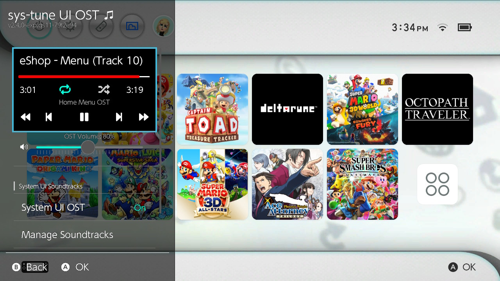
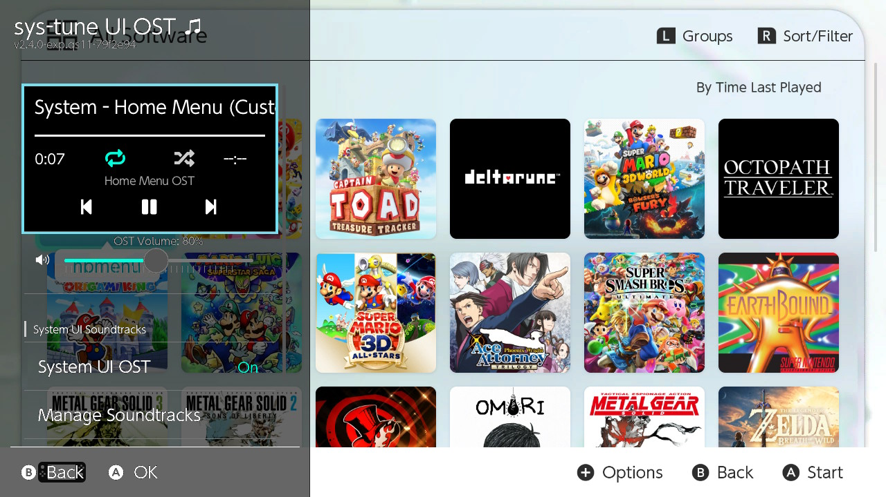
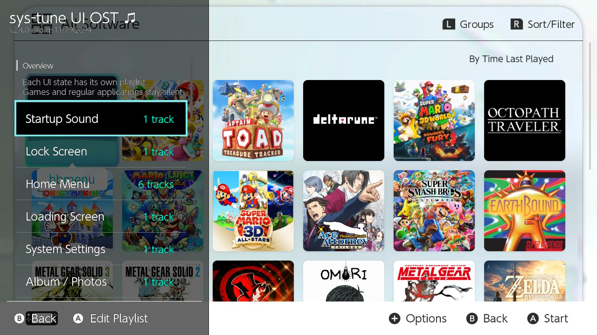
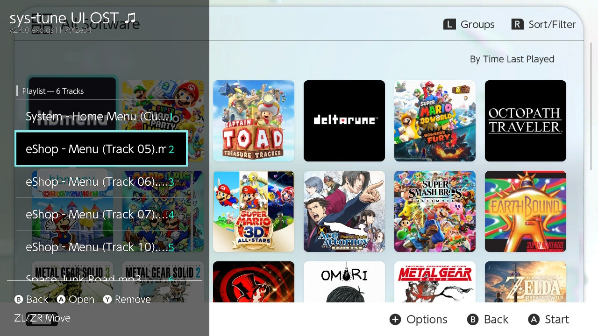

# sys-tune-ost

**Your own background music for the Nintendo Switch menus.**

Choose music for Home, Settings, the Lock Screen and other system screens,
then manage it through the Ultrahand/Tesla overlay.

- **Separate soundtracks:** give each screen its own playlist.
- **Home picks up where you left off:** your track resumes when you return.
- **Startup and wake sounds:** optionally play a sound when the console starts or wakes.
- **Music follows the menus:** designed to stop during gameplay, with an optional soundtrack for the initial game launch.
- **Playback your way:** shuffle, repeat, volume and fade controls. Supports MP3, FLAC and WAV/WAVE.

**[Download an install ZIP](https://github.com/anastaci1a/sys-tune-ost/releases)** · [User guide](docs/USAGE.md) · [Known issues](docs/TODO.md)

## Installation

Requires a Switch running Atmosphère with Ultrahand or Tesla set up.

1. Download the release's **install ZIP**, rather than GitHub's source-code archive.
2. Extract it to your SD card root, merging the `atmosphere` and `switch` folders.
3. Put your music in `/music/` on the SD card; subfolders work too.
4. Fully reboot the console, then open **sys-tune** in Ultrahand/Tesla.
5. Open **Manage Soundtracks**, add songs, and turn on **System UI OST** on the main page. It starts off by default.

When updating, install the overlay and system module together from the same ZIP.
Back up `/config/sys-tune/config.ini` to keep a copy of your settings.

**Experimental:** some screen transitions still need testing, and an intermittent
freeze/crash involving Ultrahand and User Select remains unresolved.
See the [known issues and testing checklist](docs/TODO.md).

## Screenshots

| Home Menu playback | All Software playback |
| --- | --- |
|  |  |

| Manage Soundtracks | Playlist editor |
| --- | --- |
|  |  |

## Build manually

In a configured devkitPro shell with **devkitA64, libnx, Make and ZIP** installed:

```sh
git clone https://github.com/anastaci1a/sys-tune-ost.git
cd sys-tune-ost
git config submodule.overlay/lib.url https://github.com/WerWolv/libtesla.git
git submodule update --init --recursive
make -j1 clean
make -j1 dist
```

The install ZIP is written to `dist/`. The [build guide](docs/BUILD_AND_RELEASE.md)
also covers the pinned Docker environment and package verification.

## Project documentation

[docs/](docs/README.md) contains the architecture, configuration, development
history and outstanding work. Contributor/agent procedures are in [AGENTS.md](AGENTS.md).

Based on [HookedBehemoth/sys-tune](https://github.com/HookedBehemoth/sys-tune),
with libtesla and the original audio decoders. [Credits](docs/USAGE.md#special-thanks).
